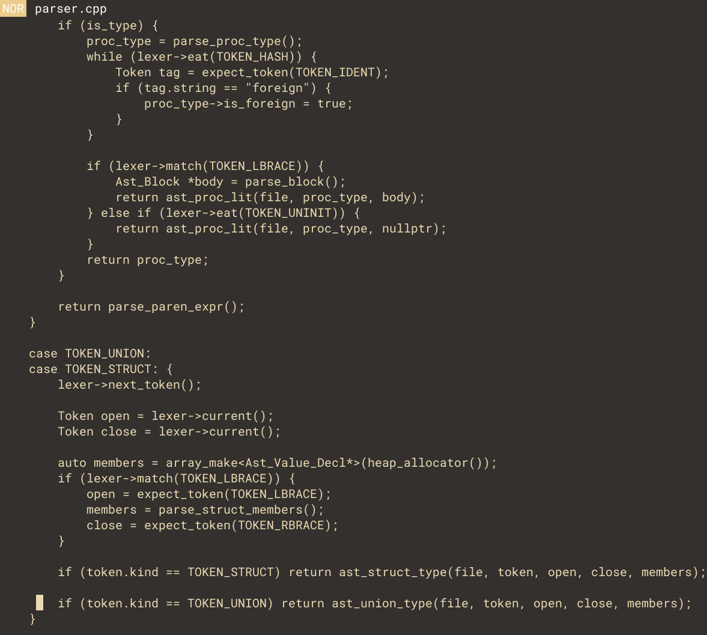

An Vim / Emacs inspired editor, written in C++.

The editing model is mostly based on Vim.

# Features
- Vim-like modal editing

GUI based editor using native graphic APIs. Planning on adding terminal-based support.

# Build
Run build.bat
